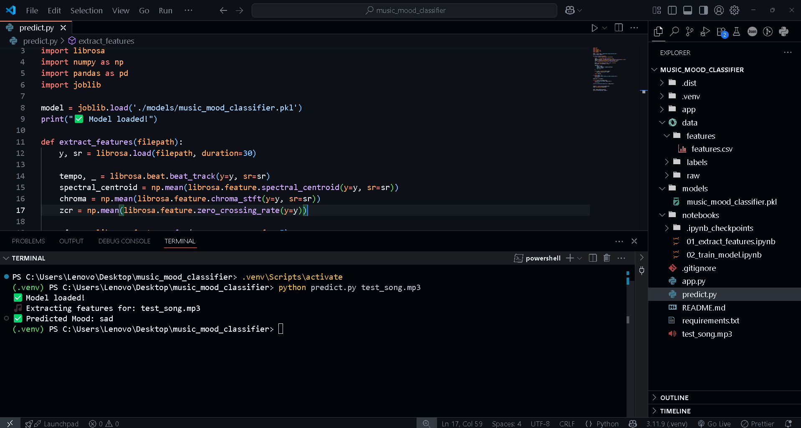

# 🎵 Music Mood Classifier

This project is a simple Machine Learning app that predicts the **mood** of an audio file based on extracted audio features. It’s built with **Python**, **scikit-learn**, **librosa**, and deployed as a **Streamlit web app**.

---

## 📌 Project Overview

- **Input:** An audio file (`.wav` or `.mp3`)
- **Processing:** Extracts audio features like tempo, spectral centroid, chroma, ZCR, and MFCCs.
- **Output:** Predicts the song’s mood (e.g., happy, sad, energetic, romantic, dramatic, angry, etc.)
- **Interface:** Upload audio through a simple Streamlit app or run prediction from the command line.

---

## 📂 Project Structure

```text
music_mood_classifier/
├── models/
│ └── music_mood_classifier.pkl # Saved trained model
├── data/
│ ├── raw/ # Raw audio files (optional, often ignored in Git)
│ ├── features/ # Extracted features CSVs
│ ├── labels/ # Labels CSVs
├── app.py # Streamlit web app
├── predict.py # Standalone prediction script
├── requirements.txt # Dependencies
├── README.md # Project readme
└── .gitignore # Files/folders to ignore in Git
```


---

## 🚀 How to Run

### Clone the Repository

```bash
git clone https://github.com/vatsalyd/music-mood-classifier.git
cd music-mood-classifier
```

### Create a virtual environment

Windows
```python
python -m venv venv
.\venv\Scripts\activate
```
macOS/Linux
```python
python3 -m venv venv
source venv/bin/activate
```

### Install dependencies

```python
pip install -r requirements.txt
```

### Run the streamlit app

```python
streamlit run app.py
```


### Use the Command-Line Predictor

```pyhton 
python predict.py path/to/your/audiofile.wav
```
e.g. python predict.py test_song.wav




# ⚙️ Training Details

- Features: Tempo, spectral centroid, chroma STFT, zero crossing rate, MFCCs.
- Model: Random Forest Classifier.
- Labels: Custom mood categories (happy, sad, romantic, dramatic, angry, etc.)


# 🙌 Credits

- Developed by VATSAL.
- Powered by open-source Python libraries: scikit-learn, librosa, Streamlit.


